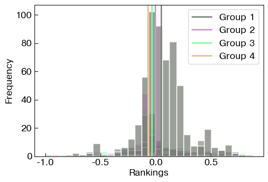

<p align="center">
  <em><strong>regrank</strong> implements a suite of regularized models to infer the hierarchical structure in a directed network.</em>
</p>

<p align="center">
  <a href="https://docs.netscied.tw/regrank/index.html" target="_blank"><strong>Docs</strong></a> ·
  <a href="https://github.com/junipertcy/regrank/discussions" target="_blank"><strong>Discussions</strong></a> ·
  <a href="https://docs.netscied.tw/regrank/index.html" target="_blank"><strong>Examples</strong></a>
</p>

<p align="center">
<a href="https://pypi.org/project/regrank/"></a>
<a href="https://pypi.org/project/regrank/"></a>
<a href="https://github.com/junipertcy/regrank/blob/main/LICENSE"></a>
</p>

This is the software repository behind the paper:

- Tzu-Chi Yen and Stephen Becker, _Regularized methods for efficient ranking in networks_, in preparation.

## Installation

**RegRank** relies on [Ax](https://ax.dev/) for hyperparameter search. If you are using Mac, according to [Ax's docs](https://ax.dev/docs/installation.html), we recommend you [install PyTorch manually](https://pytorch.org/get-started/locally/#anaconda-1) before installing Ax, using the Anaconda package manager.

```bash
conda create --name regrank-dev -c conda-forge graph-tool
conda activate regrank-dev
conda install pytorch torchvision -c pytorch  # OSX only (details below)
pip install regrank
```

## Example

```python
# Import the library
import regrank as rr

# Load a data set
g = rr.datasets.us_air_traffic()

# Create a model
model = rr.SpringRank(method="annotated")

# Fit the model: We decided to analyze the `state_abr` nodal metadata,
# We may inspect `g.list_properties()` for other metadata to analyze.
result = model.fit(g, alpha=1, lambd=0.5, goi="state_abr")

# Now, result["primal"] should have the rankings. We can compute a summary.
summary = model.compute_summary(g, "state_abr", primal_s=result["primal"])
```

Let's plot the rankings, via `rr.plot_hist(summary)`. Note that most of the node categories are regularized to have the same mean ranking.



We provided a summary via `rr.print_summary_table(summary)`.

      +-------+-------+--------+-----------------------------------------+--------+---------+
      | Group | #Tags | #Nodes | Members                                 |   Mean |     Std |
      +-------+-------+--------+-----------------------------------------+--------+---------+
      | 1     |     5 |    825 | CA, WA, OR, TT, AK                      |  0.047 | 1.1e-02 |
      | 2     |     4 |    206 | TX, MT, PA, ID                          | -0.006 | 4.2e-03 |
      | 3     |    43 |   1243 | MI, IN, TN, NC, VA, IL, CO, WV, MA, WI, | -0.035 | 4.3e-03 |
      |       |       |        | SC, KY, MO, MD, AZ, PR, LA, UT, MN, GA, |        |         |
      |       |       |        | MS, HI, DE, NM, ME, NJ, NE, VT, CT, SD, |        |         |
      |       |       |        | IA, NV, ND, AL, OK, AR, NH, RI, OH, FL, |        |         |
      |       |       |        | KS, NY, WY                              |        |         |
      | 4     |     1 |      4 | VI                                      | -0.072 | 0.0e+00 |
      +-------+-------+--------+-----------------------------------------+--------+---------+

The result suggests that states such as `CA`, `WA`, or `AK` are significantly more _popular_ than other states.

## Data sets

We have a companion repo, [regrank-data](https://github.com/junipertcy/regrank-data), which stores the data sets used in the paper. These data can be loaded via the [regrank.datasets](https://junipertcy.github.io/regrank/datasets.html) submodule, and will load into a graph-tool graph object. See the [docs](https://docs.netscied.tw/regrank/index.html) for more description.

- [PhD_exchange](https://github.com/junipertcy/regrank-data/tree/main/PhD_exchange)
- [Parakeet](https://github.com/junipertcy/regrank-data/tree/main/parakeet)
- [Austrian internal migrations](https://networks.skewed.de/net/at_migrations): Network of migrations between municipalities in Austria, from 2002 to 2022.
- [U.S. air traffic](https://networks.skewed.de/net/us_air_traffic): Yearly snapshots of flights among all commercial airports in the United States from 1990 to today.

## Development

We use `pytest` to ensure the consistency and correctness during development. The test suite uses CVXPY's SCS solver to compare results. One may optionally use other solvers but they must be installed independently. See CVXPY's [installation guide](https://www.cvxpy.org/install/index.html). Use `pre-commit run --all-files` for pre-commit checks.

## License

**regrank** is open-source and licensed under the [GNU Lesser General Public License v3.0](https://www.gnu.org/licenses/lgpl-3.0.en.html). This means that you are welcome to include this library in your own projects, whether they are open-source or proprietary. The main idea is to allow you to use the library's functionality freely, while ensuring that any improvements made directly to regrank itself are shared back with the community -- through a legal mechanism called ["weak copyleft"](https://fossa.com/blog/all-about-copyleft-licenses/).

## Acknowledgments
TCY wants to thank Perplexity.ai and [gemini-2.5-pro-preview-06-05](https://cloud.google.com/vertex-ai/generative-ai/docs/models/gemini/2-5-pro).
