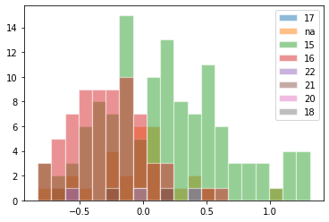

# Regularized-SpringRank

[](https://github.com/junipertcy/Regularized-SpringRank/blob/main/COPYING)


**Regularized_SpringRank** implements a collection of regularized, convex models (+solvers) that allow the inference of hierarchical structure in a directed network, which exists due to dominance, social status, or prestige. Specifically, this work leverages the time-varying structure and/or the node metadata present in the data set.

This is the software repository behind the paper:
* Tzu-Chi Yen and Stephen Becker, *Regularized methods for efficient ranking in networks*, in preparation.


* For full documentation, please visit [this site](https://).
* For general Q&A, ideas, or other things, please visit [Discussions](https://).
* For software-related bugs, issues, or suggestions, please use [Issues](https://).


First steps
-----------
`Regularized-SpringRank` _will be_ on PyPI. To start, hit this command on the shell:

```sh
$ pip install regularized-springrank
```

In your Python console, `simplicial-test` is invoked using:

```python
>>> from reg_sr import rSpringRank, PhDExchange
>>> pde = PhDExchange()
>>> g = pde.get_data(goi="c18basic")
>>> rsp = rSpringRank(method="annotated")
>>> result = rsp.fit(g, alpha=1, lambd=1, printEvery=0)  # actual computation; takes ~5 seconds
>>> pde.compute_basic_stats(rsp.sslc, primal_s=result["primal"])
>>> print(pde.print_sorted_mean(5), "\n")  # output the higher mean SpringRank categories
[('15', 0.1707651338294165), ('na', -0.04295735042383188), ('22', -0.042962551997466514), ('18', -0.0429638541050557), ('21', -0.04296445559099135)] 
>>> pde.plot_hist(bin_count=20, legend=True)
```



### Development
TODO.

Related links
-------------
TODO.

Acknowledgement
---------------
TODO.
